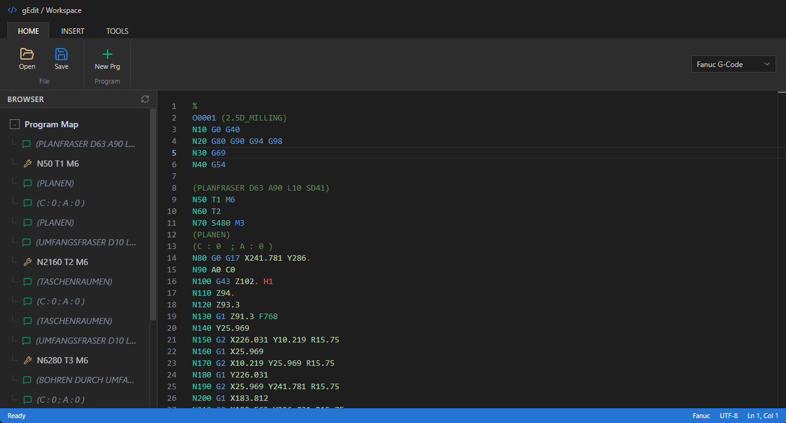
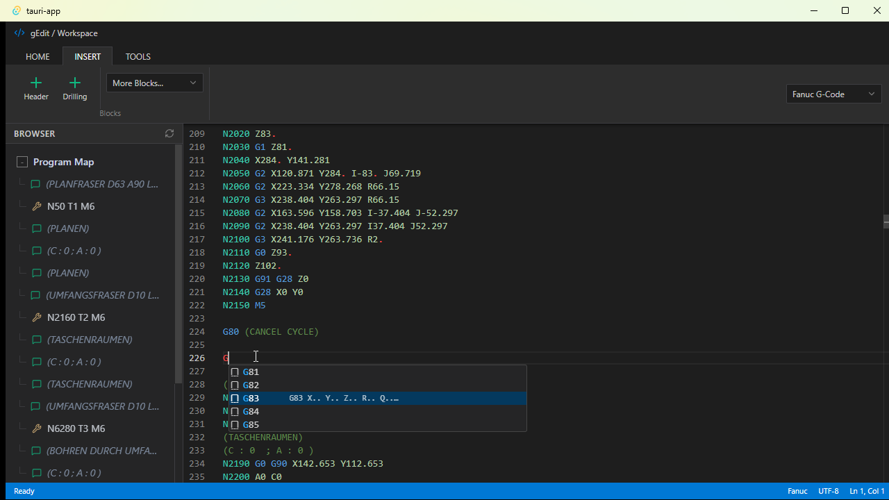
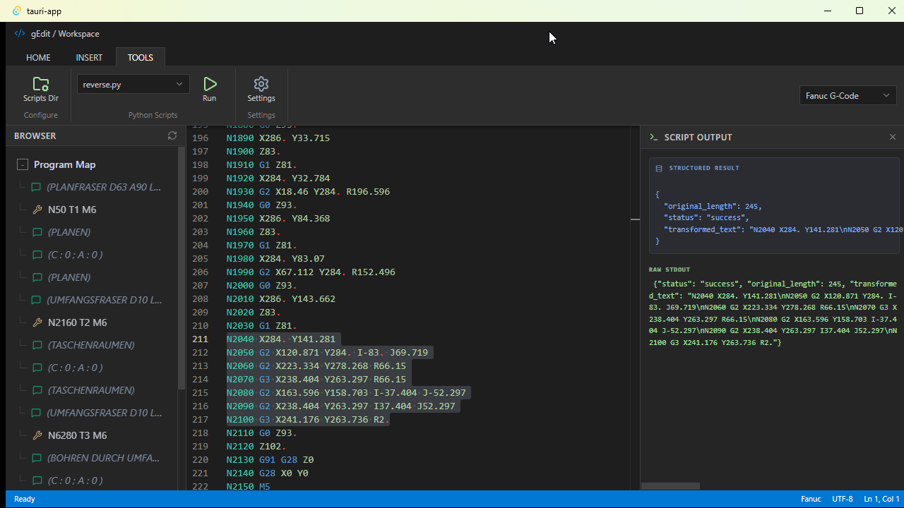

# gEdit

A desktop G-code editor for CNC programming. Built with Tauri, SvelteKit and Monaco.

Supports two dialects:

- **Fanuc G-Code** (`.nc`, `.txt`, `.min`)
- **Heidenhain Klartext** (`.h`, `.txt`)



## Features

- **Syntax highlighting** for Fanuc G-Code and Heidenhain Klartext.
- **Autocomplete** for G/M codes and cycles.

  

- **Program map** — a browser panel listing tool calls and comments; click an entry to jump to that line. Updates automatically while you type.
- **Code blocks** — insert ready-made snippets (program header, drilling cycle, etc.) from the ribbon.
- **Python post-processing** — point gEdit at a folder of Python scripts and run one against the current file (or selected text). The script receives the code on stdin; its stdout is shown in the output panel, and JSON output is parsed into a structured view.

  

- **Open / Save / Save As** (`Ctrl/Cmd+O`, `Ctrl/Cmd+S`, `Ctrl/Cmd+Shift+S`). The dialect is detected from the file extension and content, unsaved changes are marked in the title and you are asked before they are discarded. Files keep their encoding (UTF-8, UTF-8 with BOM, or Windows-1252) and line endings when saved.
- **Works offline** — the editor is bundled with the app; nothing is loaded from the network.

## Requirements

- To build: [Node.js](https://nodejs.org/), [Rust](https://www.rust-lang.org/tools/install), and the [Tauri prerequisites](https://tauri.app/start/prerequisites/) for your platform.
- To use the Python script runner: Python 3. On Windows, `python` must be on `PATH`. On macOS/Linux, gEdit looks up `python3` through your login shell (so a Homebrew or python.org install is found even when the app is started from Finder), then in common install locations. Set the `GEDIT_PYTHON` environment variable to use a specific interpreter.

## Development

```bash
npm install
npm run tauri dev
```

## Build

```bash
npm run tauri build
```

Installers are written to `src-tauri/target/release/bundle/`.

## Planning

Scope, roadmap and feature notes are in [docs/planning](docs/planning/README.md).

## License

MIT
