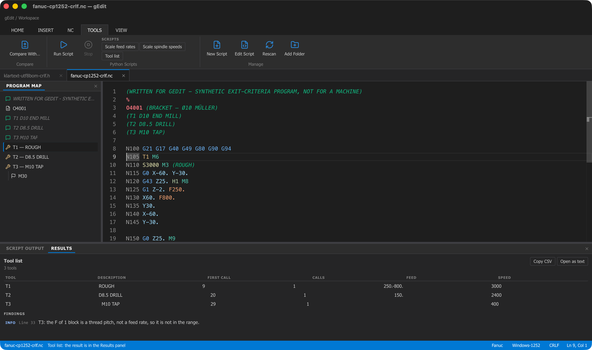

# gEdit

A desktop editor for NC code. It is the tool you open after the post-processor has run:
read the program, find your way around it, clean it up, renumber it, scale the feeds, list
the tools, compare it with the last version, and save it without changing a byte you did
not ask to change.

Built with Tauri, SvelteKit and Monaco. It works offline — the editor is bundled with the
app and nothing is loaded from the network.

Three dialects:

- **Fanuc (ISO) mill** — `.nc`, `.tap`, `.cnc`, `.eia`, `.iso`, `.min`, `.ncc`, `.ptp`, `.txt`
- **Fanuc (ISO) turning** — the same extensions; turret tool changes, the lathe meanings of
  the cycle and threading codes, `U`/`W` incremental and `X` as a diameter
- **Heidenhain Klartext** — `.h`

Next to the dialect sits the **machine configuration**: how one particular control reads
what the dialect describes — whether a number without a decimal point means millimetres or
the smallest input increment, which G-code system a lathe uses, whether `X` is a diameter,
and what is already in effect when a program starts. You define your machines once and pick
one per file; without a machine gEdit says which defaults it is assuming, and where the
possible readings disagree it refuses to convert rather than guess. See
[docs/user/machines.md](docs/user/machines.md).


*A Fanuc mill program and a Klartext program open in tabs. On the left the program map —
the program name, the header comments, the three tool calls with the comment that describes
each one, and the program end — with the entry the cursor is in marked. At the bottom the
status bar: the file, the dialect, the encoding, the line ending and the cursor position.
The programs are the project's own synthetic samples from `tests/fixtures/exit/`.*

## Features

**Files that survive the round trip.** Several files open at once, in tabs, by dialog or by
drag and drop. Encoding (UTF-8, UTF-8 with BOM, UTF-16, Windows-1252), line endings and the
punched-tape NUL leader and trailer are detected and written back unchanged. A program you
open and save without editing is byte for byte the file you started with. Unsaved changes
are marked and are asked about before they are lost, and a file changed on disk by the CAM
system is noticed while you work.

**Work you cannot lose.** The file is copied aside before the save that would overwrite it.
Unsaved work is snapshotted while you edit, so a crash or a power cut is offered back the
next time you start — and a restore never overwrites a file that changed in the meantime
without saying so. Your open tabs come back with the dialect, machine, cursor and bookmarks
you left them with, and a file you may not write routes Save to Save As before anything is
copied.

**Dialect profiles.** What a control considers a comment, a block number, a tool change or
a program start is data, not code. The dialect is detected from the extension *and* the
content, and can be changed in the status bar.

**Reading a program.** Syntax highlighting; a program map of tool calls, sections,
comments, labels, stops and subprogram calls; go to line or block number (`Ctrl+G`); next
and previous tool change (`F7`); bookmarks; folding and a sticky section heading; hover
help and completion from a code database written for the subset of code CAM systems emit.


*The hover on `G81`: what the code does, that it is a modal cycle, and the words it needs.
It comes from the code database, not from the program on screen, and a code the database
does not describe says so rather than guessing.*

**NC transformations.** Renumber blocks and remove block numbers, insert or remove the
spaces between words, remove empty lines, remove comments (keeping the program name and
your header), convert case. Each one runs on the selection or the whole program, is one
undo step, and lists in a Results panel every line it refused to touch and why. They warn
before they break a jump that points at a block number.

**Comparison.** Compare the document with the version on disk, another tab, or any file,
side by side or inline.

**Python scripts.** Run a script over the program or the selection: it gets the text on
stdin and the document's metadata, the resolved dialect and the code database in a JSON
context. Its result can replace the input as one undo step, open in a new tab, or come back
as a clickable table of findings. Parameters declared in the script become a form. Runs
have a time limit and a Cancel button. Three scripts ship with the app — scale feed rates,
scale spindle speeds, tool list — and they use the same contract as one you write yourself.



*The Tools tab, with the three bundled scripts in the Python Scripts group, just after the
tool list ran over the program in the editor. Its table is in the Results panel — the
tools in order of first use, with the comment that describes each one, the line it is first
called on, the number of calls and the feed and speed range — and under it the one finding:
the `F` of the tapping block is a thread pitch, so it is not counted as a feed rate. A row
with a line number jumps there when you click it.*

**The rest.** Ready-made code blocks per dialect (program header, drilling cycle) from the
Insert tab; light, dark or system theme; a settings dialog; recent files; a command palette
(`F1`) and a shortcut list that are generated from the commands themselves.

### Only run scripts you trust

A script is an ordinary program running with your rights. It can read and write your files
and reach the network, and **gEdit cannot sandbox it**. What gEdit does guarantee is that
nothing runs by itself, that only scripts in the folders you listed can be started, that
bundled scripts are never writable, and that a run is bounded by a timeout, a Cancel button
and capped output — it does not and cannot guarantee anything about what is *inside* a
script. Read a script before you run it, the same way you would read a macro somebody
mailed you. The full picture is in
[docs/user/scripts.md](docs/user/scripts.md#security).

### What gEdit does not do

No backplot, simulation or 3D display. No DNC or machine communication. No program
management. Fanuc mill, Fanuc turning and Klartext — Okuma OSP and Sinumerik are planned,
and so is multi-channel support for twin-turret machines. Python
is needed **only** for the script features; everything else works without it. The
[user guide](docs/user/README.md) lists the limits in full.

## Documentation

- **[User guide](docs/user/README.md)** — what the program does and how to use it, plus
  [dialects](docs/user/dialects.md), [machines](docs/user/machines.md),
  [transformations](docs/user/transformations.md), [scripts](docs/user/scripts.md) and the
  [keyboard](docs/user/shortcuts.md).
- **[Planning](docs/planning/README.md)** — scope, roadmap and feature notes.
- **[CONTRIBUTING.md](CONTRIBUTING.md)** — setup, conventions, checks and the runtime harness.

## Requirements

- To build: [Node.js](https://nodejs.org/), [Rust](https://www.rust-lang.org/tools/install), and the [Tauri prerequisites](https://tauri.app/start/prerequisites/) for your platform.
- To use the script features: Python 3.9 or newer. On Windows, gEdit asks the `py` launcher which interpreter `py -3` would start, and otherwise takes `python` or `python3` from where a command prompt would find it — never the Microsoft Store placeholders that a clean Windows has on `PATH` before Python is installed. On macOS and Linux it looks up `python3` through your login shell (so a Homebrew or python.org install is found even when the app is started from Finder), then in common install locations. The interpreter can also be set in the settings dialog, or with the `GEDIT_PYTHON` environment variable.

## Development

```bash
npm ci
npm run tauri dev
```

Type check and unit tests: `npm run check` and `npm test`. Setup, conventions, the full list
of checks and the macOS runtime harness are described in [CONTRIBUTING.md](CONTRIBUTING.md).

## Build

```bash
npm run tauri build
```

Installers are written to `src-tauri/target/release/bundle/`.

## Contributing

Contributions are welcome. Please read [CONTRIBUTING.md](CONTRIBUTING.md) before opening a
pull request.

## License

MIT. Third-party license notices are generated into `src/lib/data/licenses.json`
(`npm run licenses`) and shown in the About dialog.
