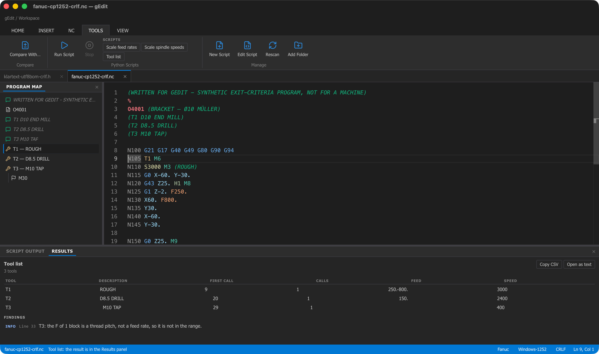

# gEdit

A desktop editor for NC code. It is the tool you open after the post-processor has run:
read the program, find your way around it, clean it up, renumber it, scale the feeds, list
the tools, check it before it goes to the machine, compare it with the last version, and
save it without changing a byte you did not ask to change.

Built with Tauri, SvelteKit and Monaco. It works offline — the editor is bundled with the
app and nothing is loaded from the network.

Six dialects:

- **Fanuc (ISO) mill** — `.nc`, `.tap`, `.cnc`, `.eia`, `.iso`, `.ncc`, `.ptp`, `.txt`
- **Fanuc (ISO) lathe** — the same extensions; turret tool changes, the lathe meanings of
  the cycle and threading codes, `U`/`W` incremental and `X` as a diameter
- **Heidenhain Klartext** — `.h`
- **Okuma OSP lathe** — `.min`, `.sub`, `.ssb`; sequence names, four- and six-digit turret
  tool words, `CALL`/`RTS`, and the machine's unit system, which can scale every number
- **Sinumerik 840D (turning)** — `.mpf`, `.spf`; `;` comments and strings, labels, cycle
  calls, tools by number or by name, and diameter programming on from the start
- **Sinumerik 840D (milling)** — the same language; `M6` changes the tool and a `T` alone
  only preselects it, the program starts in `G17`/`G94`, `X` is a radius

Next to the dialect sits the **machine configuration**: how one particular control reads
what the dialect describes — whether a number without a decimal point means millimetres or
the smallest input increment (or, on an Okuma, what unit every number is counted in,
decimal point or not), which G-code system a lathe uses, whether `X` is a diameter, and
what is already in effect when a program starts. You define your machines once and pick
one per file (Klartext has no machine settings); without a machine gEdit says which
defaults it is assuming, and where the possible readings disagree it refuses to convert
rather than guess. Your machines can be exported to a file and imported on another computer.
See [docs/user/machines.md](docs/user/machines.md).

Next to the six dialects you can write **profiles and code files of your own**: a profile for
the programs of one machine or one folder that starts from a shipped dialect and changes only
what differs (the folder it is picked for, the numbering step, the typing options), and a
code file with the M codes your machine builder added, for the hover and the completion. A
Profiles page manages them, and a test shows what every rule of a profile finds in the
program you have open. See [docs/user/profiles.md](docs/user/profiles.md).


*A Fanuc mill program and a Klartext program open in tabs. On the left the program map —
the program name, the header comments, the three tool calls with the comment that describes
each one, and the program end — with the entry the cursor is in marked. At the bottom the
status bar: the file, the dialect, the encoding, the line ending and the cursor position.
The programs are the project's own synthetic samples from `tests/fixtures/exit/`.*

## Download

Installers for macOS, Windows and Linux are on the
[GitHub Releases page](https://github.com/NC-PB/gEdit/releases): a `.dmg` for macOS (Apple
Silicon and Intel), an `.msi` and a setup `.exe` for Windows, and a `.deb`, an `.rpm` and an
`.AppImage` for Linux, with a `SHA256SUMS` file to check them against. On Linux the installed
program is called `gedit-nc`, so it does not clash with the GNOME text editor `gedit`. What each
release contains is in the [CHANGELOG](CHANGELOG.md).

**The installers are not signed.** macOS and Windows warn you the first time you start
gEdit, and each needs one confirmation; the steps are under
[Installing an unsigned build](CHANGELOG.md#installing-an-unsigned-build) in the CHANGELOG.

## Features

**Files that survive the round trip.** Several files open at once, in tabs, by dialog or by
drag and drop. Encoding (UTF-8, UTF-8 with BOM, UTF-16, Windows-1252), line endings and the
punched-tape NUL leader and trailer are detected and written back unchanged. A program you
open and save without editing is byte for byte the file you started with (the one exception is
a file with CRLF line endings and a single stray CR, which is saved with a CRLF there; the
[user guide](docs/user/README.md#files) says so). Unsaved changes
are marked and are asked about before they are lost, and a file changed on disk by the CAM
system is noticed while you work.

**Work you cannot lose.** Before a save overwrites a file, the version on disk is copied
aside — by default into a history of five versions in gEdit's own data folder, so no stray
`.bak` turns up where a DNC or CAM system looks — and a copy that cannot be made is a
question, never a silent save. Unsaved work is snapshotted every half minute and whenever
the window loses focus, so a crash or a power cut is offered back the next time you start.
Restoring only reopens the text — nothing on disk is written until you save — and a file
that changed on disk since the snapshot is flagged so you can compare first. Your tabs come
back, each file with its cursor, its bookmarks and a dialect or machine you chose by hand.
A file you may not write opens locked, and Save goes to Save As. You can also lock a tab
yourself to keep your keystrokes, the NC transformations and a script's result out of a
proven program.

**Dialect profiles.** What a control considers a comment, a block number, a tool change or
a program start is data, not code. The dialect is detected from the extension *and* the
content — an Okuma extension settles it on its own — and can be changed in the status bar.
Typing follows the dialect too: letters typed in code come out in upper case (comments,
strings and free text stay as typed), and `Backspace` or `Delete` will not run two blocks
together by accident.

**Reading a program.** Syntax highlighting; a program map of tool calls, sections,
comments, labels, stops and subprogram calls; go to line or block number (`Ctrl+G`); next
and previous tool change (`F7`); bookmarks; folding and a sticky section heading; hover
help and completion from a code database written for the subset of code CAM systems emit.


*The hover on `G81`: what the code does, that it is a modal cycle, and the words it needs.
It comes from the code database, not from the program on screen, and a code the database
does not describe says so rather than guessing.*

**Understanding a block.** Put the cursor in a block and the code inspector (`Cmd/Ctrl+Alt+A`) lists
each word with what it means on your machine, and what is in force after the block (feed unit,
plane, work offset, tool, active cycle, speed limit), each with the line that set it or marked
*assumed*. A number whose value depends on the control shows what it is worth on the machine
you chose, or every reading when you chose none, and you can change it from there: gEdit writes
it the way your machine reads it and refuses what it cannot hold exactly, never rounding. The
hover adds a cycle's parameters and the meaning of a word in its block, and a narrow coloured
mark beside the line numbers shows which lines are rapids, straight moves, arcs, threads or
cycles. See [Understanding a block](docs/user/inspector.md).

**Writing with templates.** The Insert tab offers the templates of the program you are in: program
start and end, tool change, drilling, tapping, turning and threading cycles, for all six dialects.
A short form asks for the values and shows the text that will be written, with the block numbers
carried on from where you are (Klartext renumbers the blocks behind); the values are written as you
type them and refused when they do not fit, never rounded. A field can be a formula (a feed from a
pitch and a speed, worked out exactly). **Edit Cycle** changes the cycle at the cursor in a form and
rewrites only the words you changed. Templates appear in completion on an empty line, can be starred,
and you can make your own in a template manager or from a few selected lines; they are kept in your
code files. The templates that ship are marked *review pending* until they have been checked against a
machine. See [Writing with templates](docs/user/templates.md).

**NC transformations.** Renumber blocks and remove block numbers, insert or remove the
spaces between words, remove empty lines, remove comments (keeping the program name and,
if you ask, your header), convert case. Each one runs on the selection or the whole
program, is one undo step, and lists in a Results panel every line it refused to touch and
why. Renumbering rewrites the jumps, subprogram calls and cycle references whose target
block it can prove, and asks before it leaves one behind; removing block numbers keeps the
numbers something points at. Block skip puts the skip mark on a selection, at a level where
the control has several, and takes it off again; one key selects all the lines of a tool.

**Comparison.** Compare the document with the version on disk, another tab, or any file,
side by side or inline.

**Python scripts.** Run a script over the program or the selection: it gets the text on
stdin and the document's metadata, the resolved dialect, the code database and the
document's machine in a JSON context. Its result can replace the input as one undo step,
open in a new tab, or come back as a clickable table of findings. Parameters declared in
the script become a form. Runs have a time limit and a Stop button. Six scripts ship with
the app — scale feed rates, scale spindle speeds, tool list, program checks, extents and
address arithmetic — and they use the same contract as one you write yourself.



*The Tools tab as it was in the first release, with the first three bundled scripts in the Python Scripts group, just after the
tool list ran over the program in the editor. Its table is in the Results panel — the
tools in order of first use, with the comment that describes each one, the line it is first
called on, the number of calls and the feed and speed range — and under it the one finding:
the `F` of the tapping block is a thread pitch, so it is not counted as a feed rate. A row
with a line number jumps there when you click it.*

**The rest.** Light, dark or system theme; a settings dialog; recent files; a command palette
(`F1`) and a shortcut list that are generated from the commands themselves.

### Only run scripts you trust

A script is an ordinary program running with your rights. It can read and write your files
and reach the network, and **gEdit cannot sandbox it**. What gEdit does guarantee: nothing
runs by itself; only scripts in gEdit's script folders (the bundled one, your own and the
ones you added) can be started; bundled scripts are never writable; and a run is bounded
by a timeout, a Stop button and capped output. Stopping a run ends the script and the programs
it started (on Windows too); only a program the script left running after it finished by itself
stays. gEdit does not and cannot guarantee anything
about what is *inside* a script: read one before you run it, the same way you would read a
macro somebody mailed you. The full picture is in
[docs/user/scripts.md](docs/user/scripts.md#security).

### What gEdit does not do

No backplot, simulation or 3D display. No DNC or machine communication. No program
management. Only the six dialects above (and profiles of your own that start
from them), and milling on an Okuma control is not covered yet. Python is needed **only** for the script features; everything else works
without it. On Windows and Linux, logging out or shutting down skips the unsaved-changes
prompt, and the crash snapshot, taken every half minute, is all that catches the unsaved
work. Every text in the program is English. The
[user guide](docs/user/README.md#what-gedit-does-not-do) lists the limits in full, and
[TODO.md](TODO.md) the open items and decisions.

### Still to come

Phase 2 is done: reading real programs right, block skip, program checks, extents and
arithmetic on address values, comparing a re-posted program without the noise of renumbering
and number formatting, merging in both directions, search and replace by word value
(`T1` but not `T10`, `S>2000`), multi-channel programs with a check that the wait codes of the
channels match, your own profiles and code files, and the typing options such as forced upper
case (see the [roadmap](docs/planning/roadmap.md)). Phase 3, "Understand and write", is done: the code
inspector, hover help with the modal state and the motion colours, and templates with Edit Cycle,
formulas and a template manager. The built-in templates are still marked "review pending" until
they have been checked against a machine. The first release, 1.0, is prepared: the owner checks its installers and publishes it. A round of fixes and manual-based code data for all four control families has landed since; it is listed under *Unreleased* in the [CHANGELOG](CHANGELOG.md).
Showing the channels of a program side by side is planned for Phase 4.

## Documentation

- **[User guide](docs/user/README.md)** — what the program does and how to use it, plus
  [dialects](docs/user/dialects.md), [machines](docs/user/machines.md),
  [your own profiles and code files](docs/user/profiles.md),
  [channels](docs/user/channels.md),
  [understanding a block](docs/user/inspector.md) (the inspector, the hover and the motion colours),
  [writing with templates](docs/user/templates.md) (the Insert tab, Edit Cycle, formulas and the template manager),
  [transformations](docs/user/transformations.md), [scripts](docs/user/scripts.md) and the
  [keyboard](docs/user/shortcuts.md).
- **[Planning](docs/planning/README.md)** — scope, roadmap and feature notes.
- **[TODO.md](TODO.md)** — the open items and the decisions still to be made.
- **[CONTRIBUTING.md](CONTRIBUTING.md)** — setup, conventions, checks and the runtime harness.

## Requirements

- To build: [Node.js](https://nodejs.org/), [Rust](https://www.rust-lang.org/tools/install), and the [Tauri prerequisites](https://tauri.app/start/prerequisites/) for your platform.
- To use the script features: Python 3.9 or newer. On Windows, gEdit asks the `py` launcher which interpreter `py -3` would start, and otherwise takes `python` or `python3` from where a command prompt would find it — never the Microsoft Store placeholders that a clean Windows has on `PATH` before Python is installed. On macOS and Linux it looks up `python3` through your login shell (so a Homebrew or python.org install is found even when the app is started from Finder), then in common install locations; a script also gets the folders of your login shell's `PATH` added to its own (`~/.zshrc` is not read, and with `GEDIT_PYTHON` or the interpreter setting set the login shell is never started). The interpreter can also be set in the settings dialog, or with the `GEDIT_PYTHON` environment variable. `GEDIT_PYTHON` wins over the setting, and the setting — when the file it names exists — over the lookup.

## Development

```bash
npm ci
npm run tauri dev
```

Type check and unit tests: `npm run check` and `npm test`. Setup, conventions, the full list
of checks and the macOS runtime harness are described in [CONTRIBUTING.md](CONTRIBUTING.md).

## Build

```bash
npm run tauri build
```

Installers are written to `src-tauri/target/release/bundle/`.

## Contributing

Contributions are welcome. Please read [CONTRIBUTING.md](CONTRIBUTING.md) before opening a
pull request.

## License

MIT, see [LICENSE](LICENSE). Third-party license notices are generated into `src/lib/data/licenses.json`
(`npm run licenses`) and shown in the About dialog.
