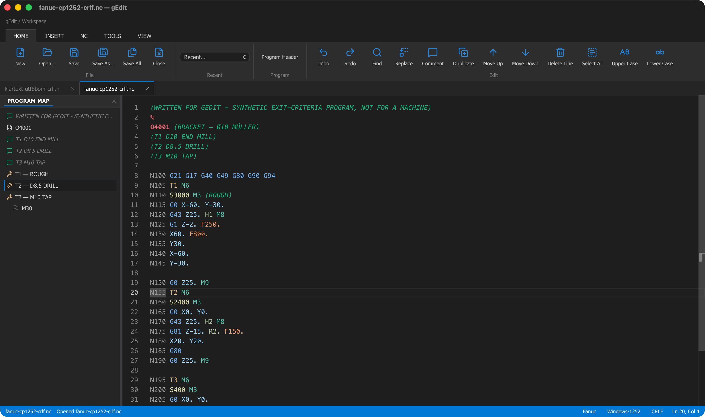
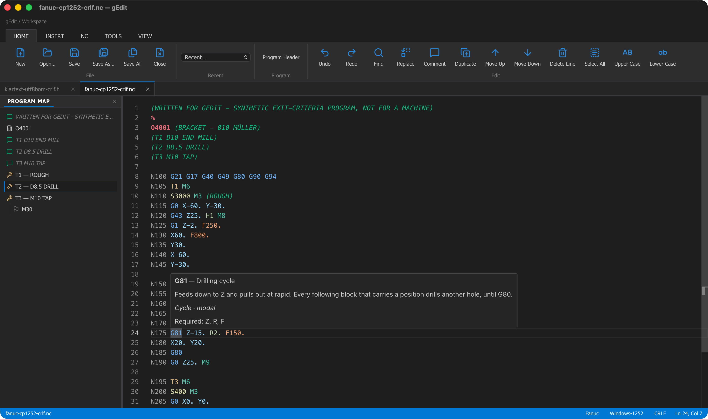

# gEdit user guide

gEdit is a desktop editor for NC code. It is meant for the program you get back from the
post-processor: read it, find your way around it, correct a few things, clean it up,
renumber it, scale the feeds, list the tools, compare it with the last version, and save
it without changing a single byte you did not ask to change.

This guide describes what the program does today. It is written for the person who runs
the machine, not for the person who builds the editor — the build and design notes are in
[../planning](../planning/README.md).

| Page | What is in it |
|---|---|
| This page | The window, files, never losing work, navigation, code help, comparing, settings, and the limits |
| [dialects.md](dialects.md) | Dialect profiles: what they decide, which three ship, how the dialect is picked |
| [machines.md](machines.md) | Machine configurations: what `X50` is worth on **your** control, and how to tell gEdit |
| [transformations.md](transformations.md) | The NC tab: renumbering and the five cleanups |
| [scripts.md](scripts.md) | Running Python scripts, and how to write one |
| [shortcuts.md](shortcuts.md) | The keyboard |

---

## The window



*The Home tab of the ribbon, two open programs in the tab bar, the Program Map on the left
and the status bar along the bottom. The theme here is the dark one.*

Across the top is the **ribbon**, with five tabs:

| Tab | What it holds |
|---|---|
| **Home** | New, Open, Save, Save As, Save All, Close · the recent-files list · a program header block · undo, redo, find, replace, comment, duplicate, move, delete line, upper and lower case |
| **Insert** | The ready-made blocks of the active dialect |
| **NC** | Renumbering and the cleanups — see [transformations.md](transformations.md) |
| **Tools** | Compare, and the scripts — see [scripts.md](scripts.md) |
| **View** | The command palette, the panels, folding, display switches, zoom, theme, settings, the shortcut list and About |

Below it are the **tabs**, one per open program, then the editor, and at the bottom the
**status bar**: the file on the left, and on the right the dialect, the machine, the
encoding, the line ending, the cursor position and — while one runs — the script.

Four of those status fields are buttons. Click the dialect to change it, the machine to say
which control this program is for ([machines.md](machines.md)), the encoding to change what
the file is written as, the line ending to change that. The machine field is not shown for
a dialect that has no machine settings.

There are three panels:

- **Program Map**, on the left (`View ▸ Side Panel`) — the structure of the program.
- **Results**, at the bottom — what a transformation skipped, and the tables and findings
  a script reports. A row with a line number jumps there when you click it.
- **Output**, at the bottom (`View ▸ Script Output`) — the raw output of a script run.

If you cannot find a command, press **F1**. That opens the command palette, which lists
every command by name. **View ▸ Keyboard Shortcuts** lists them with their keys.

## Files

**Open** (`Cmd/Ctrl+O`) takes several files at once, up to 50. You can also drag files
onto the window from Finder or Explorer; folders are ignored with a message. A file that
is already open is brought forward instead of being opened twice.

gEdit reads the file as bytes and works out three things for itself:

- **The dialect**, from the extension and from the content — see [dialects.md](dialects.md).
- **The encoding**: UTF-8, UTF-8 with a byte-order mark, UTF-16 (LE or BE, with its mark),
  or Windows-1252. A file that is valid UTF-8 is read as UTF-8; anything else is read as
  Windows-1252, which never fails — that is where the umlauts in comments from older
  controls come from.
- **The line ending**: CRLF, LF or CR. A file with mixed endings is reported in the status
  bar and saved with the ending that was in the majority.

**NUL bytes** at the very start and the very end of a file are the punched-tape leader and
trailer. They are kept out of the text, counted, and written back unchanged. NULs in the
middle are removed, and the status bar says how many — save the file to write that change.
A file that is more than 10 % NUL bytes is data, not a program, and is refused. So is a
file above 50 MB.

**Saving** writes the same encoding, the same line ending and the same leader and trailer
back. A program you open and save without editing is byte-for-byte the file you started
with. Before it writes, gEdit copies the version that is on disk aside — see
[Never losing work](#never-losing-work).

The title bar and the tab show a dot while a document has unsaved changes. Closing a tab,
closing the window, or quitting asks about them first.

### Changing encoding or line ending

The two status-bar buttons change how the file is **written**, and mark the document as
modified so the change actually reaches the disk on the next save.

They do not re-read the file. There is no "reopen with this encoding": if a file came in
as Windows-1252 and you switch it to UTF-8, the characters you see stay as they are and
are written out as UTF-8. UTF-16 always carries its byte-order mark, and it cannot carry a
tape leader — saving a file with one as UTF-16 drops the leader and says so.

### When the file changes on disk

gEdit checks the files you have open while the window has focus. If the CAM system
re-posts a program you have open:

- With no unsaved edits it is reloaded, keeping your position. (Set
  `Settings ▸ Files ▸ When a file changes outside gEdit` to **Ask what to do** if you
  would rather be asked every time.)
- With unsaved edits a bar appears above the editor with **Reload**, **Keep mine** and
  **Compare**.
- If the file is deleted, the tab is marked and your text stays. Saving writes it back.

### Recent files

The Home tab has the recent-files list, and `File ▸ Open Recent…` opens the same list as a
picker. Entries that no longer exist are marked; opening one offers to drop it from the
list. The length is a setting (0 to 50, default 15). Reopening the last session counts as
opening those files, so after a restart the top of the list is your last session's tabs —
see [Coming back where you left off](#coming-back-where-you-left-off).

## Never losing work

Four different things, covering four different accidents. It is worth knowing which one
covers what:

| What happened | What covers it |
|---|---|
| You saved over a good program | The **backup copy**, made just before the save |
| The power went, or the computer crashed | The **recovery snapshot**, taken every half minute |
| You closed gEdit and want your tabs back | **Session restore** |
| You typed into a program you did not mean to touch | **Read-only** |

The first three are switches on the `Settings ▸ Files` page and all three are on out of
the box; read-only comes from the file itself or from a command. None of them replaces
your own backups — read [What none of this protects](#what-none-of-this-protects) before
you rely on any of it.

### Before a save: the backup copy

Every time gEdit is about to write over a file that already exists, it first copies **what
is on disk** aside. That copy is the *previous version of the program* — not your unsaved
text, which is what the recovery snapshot is for.

`Settings ▸ Files ▸ Keep a copy before saving`:

| Setting | Where the copy goes |
|---|---|
| **In gEdit (keeps several versions)** — the default | Inside gEdit's own data folder, several versions deep |
| **Next to the file (.bak)** | `<your program>.bak`, in the same folder, overwritten on every save |
| **Do not keep one** | Nothing is copied |

The default keeps the copies out of your program folder on purpose. A DNC folder watcher
or a CAM output folder that picks up whatever appears in it would otherwise find
`WELLE.bak` and post it to a machine. Use the `.bak` setting only where the folder is
yours alone. On macOS and Linux the `.bak` copy is given the same permissions as the
program it was made from, so a program only you can read does not get a copy beside it
that everyone can.

**How many.** `Settings ▸ Files ▸ Versions to keep` (1 to 50, default 5) is how many
earlier versions gEdit keeps **per file**: save the same program six times and the oldest
of the six goes. It bounds each file, not the folder as a whole — a thousand programs
saved five times each are five thousand copies, and nothing deletes them for you. The
`.bak` setting keeps exactly one, so the second save overwrites the copy the first made.

**Where they are.** Under `<data>/backups`: a folder per program folder, a folder per file
name, one file per version.

```
<data>/backups/3f1a9c04/WELLE.NC/20260421-134502.881-WELLE.NC
```

`3f1a9c04` is a short code for the folder the program lives in — two folders can both hold
`WELLE.NC`, so the folder has to be part of the name. What you search for is the file
name, which is the folder inside it. The time stamp is **UTC**, so the names keep sorting
in order across a clock change; it is not your local time.

A backup is an ordinary copy of the file. Open one with `File ▸ Open`, or compare it with
what you have now (`Cmd/Ctrl+Alt+C`, then pick the file).

**A new program has nothing to copy.** The first save of a file that is not on disk yet
writes no backup, because there is no earlier version of it.

**If the copy cannot be made** — a full disk is the usual reason — gEdit stops and asks.
**Cancel** writes nothing at all: the file on disk is still the last good version and your
text is still in the tab, so nothing is lost either way. **Save Without a Backup** goes
ahead, and the status bar says afterwards that this one save has no previous version
anywhere. gEdit never makes that choice for you.

**If the save itself fails** after the copy was made, the message names the copy. That is
the repair instruction: your last good program is that file.

### After a crash: unsaved work comes back

While a document has unsaved changes, gEdit writes its text aside **every 30 seconds**,
and again the moment you switch away from the window — which is the moment before a
computer gets put to sleep or shut down. A document with nothing unsaved is not written at
all, and neither is one you have not touched since its last snapshot.

The snapshot holds the text together with the document's encoding, line ending and tape
leader, so restored work saves back the same way the original would have. It goes into
gEdit's own data folder, and **nothing is sent anywhere**.

A snapshot is dropped as soon as it cannot be needed: when you save the document, when you
close it, and — for the whole run — when you quit gEdit normally.

**What you see afterwards.** The next start says *Unsaved work was found* and lists each
document with what restoring it would do to the file on disk:

- the file has not changed since the snapshot;
- the file **changed on disk** after the snapshot — the text comes back, the file is left
  exactly as it is, and the changed-on-disk bar is already up so you can compare before
  you decide what to keep;
- the file is no longer there — it reopens with your text, and saving writes it again;
- it was never saved to a file — it reopens as an untitled document;
- gEdit **could not tell which file the text belongs to**. That happens when the crash
  landed between the two files a snapshot is made of, before the first one of a document
  had both halves. The text is all there; where it came from is not, so it reopens
  untitled and Save As puts it back.

**Restoring writes nothing.** It reopens the text in the editor as an unsaved document; no
file on disk is touched until you save it yourself. **Later** leaves everything where it
is and asks again next time. **Discard** deletes that unsaved work for good, and asks once
more before it does.

**Two minutes of quiet.** gEdit cannot ask the operating system whether the run that wrote
a snapshot is dead, so it goes by a heartbeat: a running gEdit touches a file every 30
seconds, and a run that has been silent for **two minutes** counts as crashed. That is
also why a second gEdit never offers you the first one's documents. The cost is that a
restart within a couple of minutes of the crash sees no dialog straight away — gEdit takes
one more look about two and a half minutes in, and otherwise offers the work at the next
start. `Show recovered work` in the command palette (**F1**) asks at any time.

**When snapshots go.** Leftover work nobody came back for is deleted after **14 days**,
and the whole recovery folder is capped at 200 MB, oldest run first. Turning the feature
off (`Settings ▸ Files ▸ Recover unsaved changes after a crash`) stops new snapshots but
does **not** throw away what is already there: work written while it was on is still
offered back.

**What a crash costs you.** At worst the last 30 seconds of typing — and switching away
from the window costs you nothing: it adds a snapshot rather than postponing the next one.

**If a snapshot cannot be written at all** — the disk is full, or the document has grown
past what a snapshot may hold — gEdit says so in the status bar once, because a crash net
that is quietly off is worse than none. Save to a file when you see it.

**If the file is already open again.** Session restore may have reopened the program
before you answer the dialog. The recovered text then comes back in an *untitled* tab
named after the file rather than on the file itself — the work is all there, but Save asks
where to put it. Close the other tab and use Save As onto the program, or close it first
and restore again.

### Coming back where you left off

**Reopen the last files at start.** The programs that were open when gEdit was last closed
come back, up to 50 of them, with the one you were on in front. A file gEdit cannot reach
at that moment is skipped, with one message rather than one dialog per file — but it stays
in the list and is tried again at the next start, so a network share or a USB stick that
is not mounted yet when you log in costs you nothing. An
untitled document is not in the list, because there is no file to reopen — an untitled
document with unsaved text is covered by the crash snapshot instead.

Reopening a program counts as opening it, so the restored files also move to the front of
the recent list. After a restart the recent list is therefore in the order of your last
session's tabs rather than the order in which you last opened things.

**Remember where you were in each file.** Per file, gEdit remembers:

- the cursor line and column, and the line the view was scrolled to;
- the bookmarks;
- a dialect you picked by hand;
- the machine you picked for that program, including an explicit **none**, which is a
  different answer from never having chosen one — see [machines.md](machines.md).

This is kept for the last 500 files, at most 200 bookmarks each, in gEdit's own state
file — and the file itself is kept under a size of its own, so heavy bookmarking costs you
the oldest memos rather than the whole state file. **Nothing is written into your
program**: a `.nc` file does not change because you set a bookmark in it.

A memo is a convenience and never load-bearing. One that is missing, or that names a
dialect or a machine that no longer exists, is ignored, and the file opens exactly as it
would have without it. Switching the setting off does not erase what is stored — gEdit
stops reading and writing it, and switching it back on brings it back.

### Read-only programs

There are two different locks. The status bar shows **Read-only** while one of them is on;
hover it to see which, and click it to unlock. The tab shows a lock as well.

**The file is read-only on disk.** A program you may not write — one carrying the
read-only attribute on Windows, or one on macOS or Linux that belongs to another account
or sits on a share exported read-only, which is what a released program on a shop share
usually is — opens locked, and gEdit says so. Typing into
it is refused with a message in the editor. **Save** becomes **Save As**, always: gEdit
never changes a file's attributes, so the only place the text can go is a different file.
Unlocking such a document frees the editor and nothing else; Save still asks where to put
it.

**You locked the tab.** `File ▸ Lock Against Editing` in the command palette (**F1**)
locks a document against your own keystrokes — for the proven program you want open for
reference while you work on something else. Nothing on disk changes. The same command
unlocks it, and so does clicking the **Read-only** item in the status bar, which is only
there while something is locked. There is deliberately no keyboard shortcut for it: an
accidental one would look like a broken keyboard.

### What none of this protects

- **A program another application writes over.** gEdit backs up only the saves **it**
  makes. If the CAM system re-posts over a program, the version it replaced is gone as far
  as gEdit is concerned — you get the reload or the changed-on-disk bar, not a copy. (The
  next save *from gEdit* does back the re-posted version up.)
- **Logging out or shutting down on Windows and Linux.** The operating system does not let
  an application hold up a session end, so the unsaved-changes prompt is skipped and gEdit
  is killed. Only the crash snapshot covers that, which means up to the last 30 seconds of
  typing is gone. Save before you log out. (On macOS gEdit is asked first and stops at the
  prompt, whether you quit from the Dock, from another application's menu, or by logging
  out.)
- **Losing the computer or the disk.** Backups and snapshots live in gEdit's own folder on
  the same computer as the programs. They protect you against a mistake, not against a
  dead disk or a stolen laptop. Keep doing whatever you already do for the program folder.
- **A `.bak` you have saved over twice.** The sibling copy holds one version, so after two
  saves the version before last is gone. "In gEdit" is the setting that keeps several.
- **Anything that does not go through gEdit.** Deleting a program in Finder or Explorer, a
  script outside gEdit rewriting a file, a share that disappears mid-save — gEdit is not
  involved and has nothing to give back.
- **This is not version control.** There is no history you can browse in the program, no
  note on what changed and no "the version from Tuesday" — only dated copies in a folder
  that you open yourself.

## Finding your way around a program

| What you want | How |
|---|---|
| A line, or a block number | `Ctrl+G`, then `120` for the line or `N120` for the block |
| The next or previous tool change | `F7` / `Shift+F7`, wrapping around with a message |
| The structure of the program | The Program Map panel |
| A place you keep coming back to | A bookmark: `Cmd/Ctrl+F2` to set or clear it, `F2` and `Shift+F2` to step through them |
| Text | `Cmd/Ctrl+F`, the editor's own find and replace |
| A section, collapsed | `View ▸ Fold All` / `Unfold All`, and the sticky heading at the top of the editor |

**Ctrl+G** is the Control key on every platform, not Cmd — that is the key the controls
themselves use, and Cmd+G stays with "find next" on a Mac.

The **Program Map** lists what the dialect's profile says is worth listing: the program
start, tool calls, section headings, comments, labels, program stops, subprogram calls and
the program end. Click an entry to jump to it. It follows the program as you type.

Bookmarks are never written into the program: a saved `.nc` file is the same with them and
without them. gEdit remembers them for you instead, per file and alongside the cursor line
— see [Coming back where you left off](#coming-back-where-you-left-off), which is also
where you turn that off.

## Code help

Hold the pointer over a word and gEdit explains it: what the code does, which group it
belongs to, whether it stays active until something replaces it, and which addresses it
needs. Where the feed carries a thread pitch rather than a feed rate, the hover says so —
that is exactly the place where scaling a feed would cut a different thread.



*`G81`: what it does, that it is a cycle and modal, and that it wants Z, R and F.*

Typing offers completions from the same database: the codes of the active dialect with
their descriptions. Both are switched in `Settings ▸ Assistance`, and completion can be
set to appear automatically, only when you ask for it, or not at all.

The descriptions are written by the project, in its own words, for the subset of code that
CAM systems emit. A code the database does not describe says so rather than guessing. An
entry the project has written but not yet checked against a control's documentation is
**not shown in the hover at all** — the hover says the database does not describe the word,
which is the honest answer while nobody has confirmed it; the completion list shows it with
a "Not verified yet" note instead. **Your control's manual is the authority, not this
editor.**

## Comparing two programs

`Cmd/Ctrl+Alt+C` compares the current document with the version on disk, another open tab,
or any file you pick. The comparison opens over the editor, side by side or inline, with
buttons for the next and previous difference.

The current document stays editable in the comparison; the other side is read-only. Files
above 50 MB are refused.

## Settings

`Cmd/Ctrl+,` opens the settings dialog. Six pages:

| Page | What you can set |
|---|---|
| **Appearance** | Theme (System, Light or Dark), editor font and size |
| **Editor** | Tab width, spaces or tabs, whitespace display, word wrap, minimap, line numbers, current-line highlight, sticky scroll, text drag and drop, copy without a selection |
| **Assistance** | Hover help on or off; completion automatic, manual or off |
| **Files** | Length of the recent list, what happens when a file changes outside gEdit, the dialect new files start in, and the four switches of [Never losing work](#never-losing-work): the backup copy and how many versions to keep, crash recovery, session restore, per-file memory |
| **Scripts** | The Python interpreter, extra script folders, the time limit for a run, whether the bundled scripts are listed — and the path of your own scripts folder |
| **Machines** | Your machine configurations: add, edit, duplicate, remove, and which one is the default for a dialect — see [machines.md](machines.md) |

The Machines page is not a page of settings. Machine configurations are records with names
of their own, and they live in their own file (`machines.json`), not in `settings.json`.

Settings are stored as a small JSON file that holds only what you changed, so a default
that improves in a later version reaches you. `Open settings file` in the dialog opens it
as a document, for the few keys that are not in the dialog (column rulers, for example).

On macOS the file is `~/Library/Application Support/com.pburg.gedit/settings.json`, with
the equivalent folder on Windows and Linux. Your own scripts live next to it, in
`scripts/`.

## What gEdit does not do

Being clear about this saves disappointment on the shop floor.

- **No backplot, no 3D display, no simulation.** gEdit reads and writes text. It does not
  know where the tool is.
- **No machine communication.** No DNC, no serial, no FTP, no drip feed.
- **No program management.** No library, no job list, no PDM or ERP link.
- **Three dialects: Fanuc mill, Fanuc lathe and Heidenhain Klartext.** Sinumerik and Okuma
  are planned but not here yet; their programs open with the profile that fits best, which
  gets the codes wrong — see [dialects.md](dialects.md).
- **gEdit does not know your machine unless you tell it.** Whether `X50` is 50 mm or
  0.050 mm, which G-code system a lathe uses, what is modal at power-on: all of that is a
  machine setting, and with no machine configured gEdit says "assumed" and refuses to
  compute the values that depend on it. It never reads a control, and it never imports a
  parameter file — you type it in once. See [machines.md](machines.md).
- **Python is needed only for the script features.** Everything on this page, and
  everything in [transformations.md](transformations.md), works without it. If Python is
  missing, the script commands are disabled with a message and nothing else changes.
- **Scripts are not sandboxed.** A script is an ordinary program running with your rights.
  See the security section of [scripts.md](scripts.md).
- **On Windows and Linux, logging out or shutting down skips the unsaved-changes prompt.**
  The operating system does not let an application hold up a session end, so gEdit is
  killed where it stands. The crash snapshot catches most of that work, but up to the last
  30 seconds of typing is still gone. Save before you log out. (On macOS gEdit is asked
  first, so quitting from the Dock menu, from another application's menu or by logging out
  stops at the same unsaved-changes prompt as closing the window.)
- **There are no workspaces or projects.** gEdit reopens the files that were open last
  time and your place in each of them ([Never losing work](#never-losing-work)), and that
  is the whole of it: no named set of programs to switch between, nothing grouped by job
  or by machine.
- **Saves are written in place**, not written to a temporary file and moved, because on a
  share the file's identity and its rights are what the DNC drip-feeder and the CAM
  watcher see. A crash or a power cut in the middle of a save can therefore still leave a
  partial file. Unless you turned the copy off, the previous version is finished and on
  disk before the first byte is written, and the message that follows names where it is.
- **No version history inside the program.** The backup copies are dated files in a
  folder: no list to browse, no note on what changed, no merge. gEdit is not a version
  control system and does not pretend to be one.
- **English only.** Every text in the program is English.

## Where things are

| | |
|---|---|
| Settings | `<config>/settings.json` |
| Machine configurations | `<config>/machines.json` |
| Your own scripts | `<config>/scripts/` |
| Recent files, panel sizes, remembered form values, the last session, and your place in each file | `<data>/state.json` |
| Window size and position | `<config>/.window-state.json` |
| The copies made before a save | `<data>/backups/` |
| Unsaved work kept for a crash | `<data>/recovery/` |

`<config>` and `<data>` are the standard application folders of your operating system; on
macOS both are `~/Library/Application Support/com.pburg.gedit`. The settings dialog shows
the script folder, and `About gEdit` shows the version and the third-party notices.

The last two folders hold the contents of your programs, so on macOS and Linux gEdit
narrows them to your account alone and puts that back at every start.
