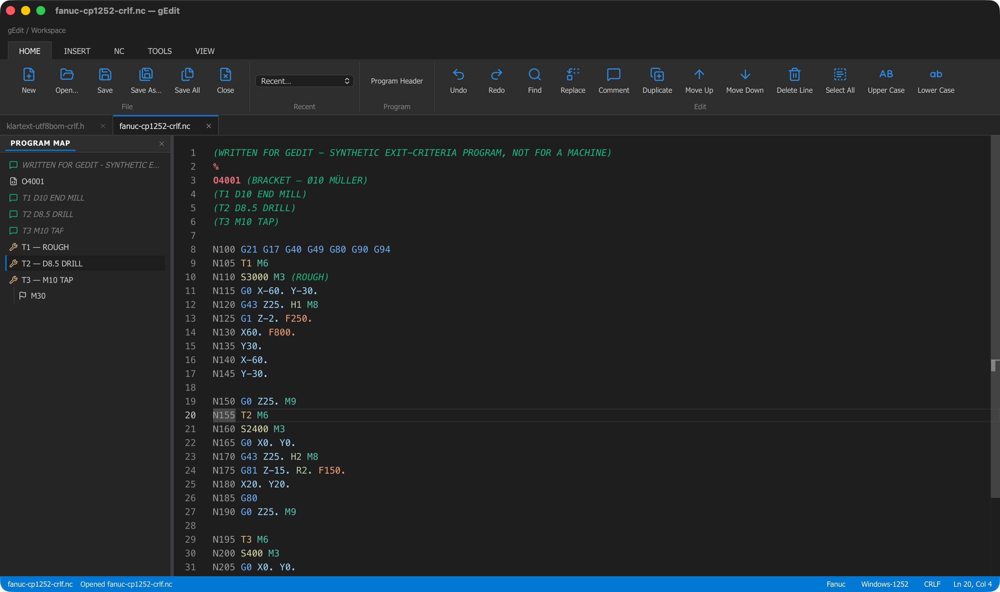
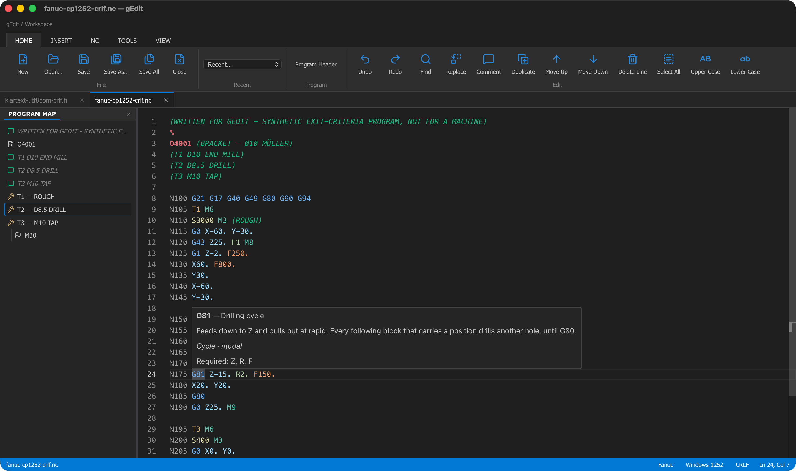

# gEdit user guide

gEdit is a desktop editor for NC code. It is meant for the program you get back from the
post-processor: read it, find your way around it, correct a few things, clean it up,
renumber it, scale the feeds, list the tools, check it before it goes to the machine,
compare it with the last version, and save it without changing a single byte you did not
ask to change.

This guide describes what the program does today. It is written for the person who runs
the machine, not for the person who builds the editor — the build and design notes are in
[the planning notes](../planning/README.md).

| Page | What is in it |
|---|---|
| This page | The window, files, never losing work, navigation, code help, comparing, settings, and the limits |
| [Dialects](dialects.md) | Dialect profiles: what they decide, which six ship, how the dialect is picked |
| [Machines](machines.md) | Machine configurations: what `X50` is worth on **your** control, and how to tell gEdit |
| [Transformations](transformations.md) | The NC tab: renumbering, removing block numbers, the five cleanups, block skip and selecting a tool's lines |
| [Scripts](scripts.md) | Running Python scripts, the six that ship (feeds, speeds, tool list, program checks, extents, address arithmetic), and how to write one |
| [Shortcuts](shortcuts.md) | The keyboard |

---

## The window



*The Home tab of the ribbon, two open programs in the tab bar, the Program Map on the left
and the status bar along the bottom. The theme here is the dark one.*

Across the top is the **ribbon**, with five tabs:

| Tab | What it holds |
|---|---|
| **Home** | New, Open, Save, Save As, Save All, Close · the recent-files list · **Program Header** (Fanuc mill and Klartext only) · undo, redo, find, replace, comment, duplicate, move, delete line, select all, upper and lower case (plain text commands; on a program use **Convert Case…** on the NC tab) |
| **Insert** | The ready-made blocks of the active dialect — Fanuc mill and Klartext only in this version; on a Fanuc lathe, Okuma or Sinumerik program the tab shows no blocks |
| **NC** | Renumbering, removing block numbers, the cleanups, block skip and selecting a tool segment — see [Transformations](transformations.md) |
| **Tools** | Compare, and the scripts — see [Scripts](scripts.md) |
| **View** | The command palette, the panels, folding, display switches, zoom, theme, settings, the shortcut list and About |

Below it are the **tabs**, one per open program, then the editor, and at the bottom the
**status bar**: the file on the left, and on the right the dialect, the machine, the
encoding, the line ending, the cursor position, the script while one runs, and
**Read-only** while the document is locked.

Every field but the file name and the cursor position is a button. Click the dialect to
change it, the machine to say which control this program is for ([Machines](machines.md)),
the encoding to change what the file is written as, the line ending to change that; click
the script to stop the run, and **Read-only** to unlock the document. The machine field is
not shown for a dialect that has no machine settings.

There are three panels:

- **Program Map**, on the left (`View ▸ Side Panel`) — the structure of the program.
- **Results**, at the bottom — what a transformation skipped, and the tables and findings
  a script reports. A row with a line number jumps there when you click it.
- **Script Output**, at the bottom (`View ▸ Script Output`) — the raw output of a script
  run.

If you cannot find a command, press **F1**. That opens the command palette, which lists
every command by name. **View ▸ Keyboard Shortcuts** lists every command with the key gEdit
gives it; the editing keys that come with the editor (undo, find, comment, …) are in
[Shortcuts](shortcuts.md).

In this guide `View ▸ Side Panel` means the **Side Panel** button on the ribbon's View tab,
`Settings ▸ Files ▸ …` a field on a page of the settings dialog, and *File: Open Recent…* an
entry of the command palette. The macOS menu bar holds only the standard system items.

## Files

**Open** (`Cmd/Ctrl+O`) takes several files at once, up to 50; pick or drop more and only
the first 50 open, with a message. You can also drag files onto the window from Finder or
Explorer; folders are ignored with a message.

A file that is already open is brought forward instead of being opened twice — also when
it is spelled differently: in other capitals on Windows and macOS, and on Windows with `/`
for `\` or with `\\?\` in front. Two different routes to one file — a mapped drive and its
`\\server\share` name, a symbolic link, a short `PROGRA~1` name — are not recognised and
give two tabs: do not edit the program in both. Save As onto a file that another tab has
open is refused.

gEdit reads the file as bytes and works out three things for itself:

- **The dialect**, from the extension and from the content — see [Dialects](dialects.md).
- **The encoding**: UTF-8, UTF-8 with a byte-order mark, UTF-16 (LE or BE, with its mark),
  or Windows-1252. A file that is valid UTF-8 is read as UTF-8; anything else is read as
  Windows-1252, which never fails — that is where the umlauts in comments from older
  controls come from. UTF-16 without its byte-order mark is not recognised: about half of
  its bytes are NUL, so it is refused as data.
- **The line ending**: CRLF, LF or CR. A file with mixed endings is reported in the status
  bar and saved with the ending that was in the majority; on a tie CRLF wins, and LF wins
  over CR.

**NUL bytes** at the very start and the very end of a file are the punched-tape leader and
trailer. They are kept out of the text, counted, and written back unchanged. NULs in the
middle are removed, and the status bar says how many — save the file to write that change.
A file whose NUL bytes *inside* the program — between the leader and the trailer — are more
than 10 % of those bytes is data, not a program, and is refused. So is a file above 50 MB.

**Save As** to a file you may not write goes back to the dialog before anything is copied or
written. Saved under another extension, a file that had a name has its dialect detected
again (see [Dialects](dialects.md#which-dialect-a-file-gets)).

**Saving** writes the same encoding, the same line ending and the same leader and trailer
back. A program you open and save without editing is byte-for-byte the file you started
with. Before it writes, gEdit copies the version that is on disk aside — see
[Never losing work](#never-losing-work).

If the text holds a character the file's encoding cannot store — Windows-1252 has no `⌀`,
for example — the save stops and asks whether to write the file as UTF-8 instead
(**Save as UTF-8** or **Cancel**), naming the character and where it is.

The title bar and the tab show a dot while a document has unsaved changes. Closing a tab,
closing the window, or quitting asks about them first.

### Changing encoding or line ending

The two status-bar buttons change how the file is **written**, and mark the document as
modified so the change actually reaches the disk on the next save.

They do not re-read the file. There is no "reopen with this encoding": if a file came in
as Windows-1252 and you switch it to UTF-8, the characters you see stay as they are and
are written out as UTF-8. UTF-16 always carries its byte-order mark, and it cannot carry a
tape leader or trailer. Picking UTF-16 for a file that has one asks first — **Drop the
leader** or **Cancel**; the save then writes the program without its tape framing and says
so, and switching back after that save does not bring it back.

### When the file changes on disk

gEdit checks the files you have open every two seconds while its window has focus, and at
once when you come back to it; a file that was only touched, with the same bytes, does not
count. If the CAM system re-posts a program you have open:

- With no unsaved edits it is reloaded, with the cursor kept on its line. The reload is one
  undo step, so `Cmd/Ctrl+Z` brings your previous text back. (Set
  `Settings ▸ Files ▸ When a file changes outside gEdit` to **Ask what to do** if you
  would rather be asked every time.)
- With unsaved edits a bar appears above the editor with **Reload**, **Keep mine** and
  **Compare**.
- If the file is deleted, the bar says so (with **Keep mine**), the tab shows ⚠ and counts
  as modified, and your text stays. Saving writes it back.

Saving over a file that changed on disk since you opened or last saved it always asks
first: **Overwrite** or **Cancel**.

### Recent files

The Home tab has the recent-files list (the **Recent…** drop-down), and **Open Recent…** in
the command palette (**F1**; listed as *File: Open Recent…*) opens the same list as a
picker. Entries that no longer exist are marked; opening one offers to drop it from the
list. The drop-down's last entry, **Clear recent files**, empties the list. Its length is
`Settings ▸ Files ▸ Recent files to remember` (0 to 50, default 15; 0 turns the list off).
Saving a file moves it to the top, and so does reopening the last session — see
[Coming back where you left off](#coming-back-where-you-left-off).

## Never losing work

Four different things, covering four different accidents. It is worth knowing which one
covers what:

| What happened | What covers it |
|---|---|
| You saved over a good program | The **backup copy**, made just before the save |
| The power went, or the computer crashed | The **recovery snapshot**, taken every half minute |
| You closed gEdit and want your tabs back | **Session restore** |
| You typed into a program you did not mean to touch | **Read-only** |

The backup copy, crash recovery and session restore are set on the `Settings ▸ Files`
page, together with the per-file memory, and all four are on out of the box: the backup
copy is a choice of three (in gEdit, next to the file, or none) with the number of
versions to keep, and the other three are switches. Read-only comes from the file itself
or from a command. None of them replaces your own backups — read
[What none of this protects](#what-none-of-this-protects) before you rely on any of it.

### Before a save: the backup copy

Every time gEdit is about to write over a file that already exists, it first copies **what
is on disk** aside. That copy is the *previous version of the program* — not your unsaved
text, which is what the recovery snapshot is for.

`Settings ▸ Files ▸ Keep a copy before saving`:

| Setting | Where the copy goes |
|---|---|
| **In gEdit (keeps several versions)** — the default | Inside gEdit's own data folder, several versions deep |
| **Next to the file (.bak)** | `<your program>.bak`, in the same folder, overwritten on every save |
| **Do not keep one** | Nothing is copied |

The default keeps the copies out of your program folder on purpose. A DNC folder watcher
or a CAM output folder that picks up whatever appears in it would otherwise find
`WELLE.NC.bak` and post it to a machine. Use the `.bak` setting only where the folder is
yours alone. On macOS and Linux the `.bak` copy is given the same permissions as the
program it was made from, so a program only you can read does not get a copy beside it
that everyone can.

**How many.** `Settings ▸ Files ▸ Versions to keep` (1 to 50, default 5) is how many
earlier versions gEdit keeps **per file**: save the same program six times and the oldest
of the six goes. It bounds each file, not the folder as a whole — a thousand programs
saved five times each are five thousand copies, and nothing deletes them for you. The
`.bak` setting keeps exactly one, so the second save overwrites the copy the first made.

**Where they are.** Under `<data>/backups`: a folder per program folder, a folder per file
name, one file per version.

```
<data>/backups/3f1a9c04/WELLE.NC/20260421-134502.881-WELLE.NC
```

`3f1a9c04` is a short code for the folder the program lives in — two folders can both hold
`WELLE.NC`, so the folder has to be part of the name. What you search for is the file
name, which is the folder inside it. The time stamp is **UTC**, so the names keep sorting
in order across a clock change; it is not your local time.

A backup is an ordinary copy of the file. Open one with **Open** (`Cmd/Ctrl+O`) — on macOS
the Library folder is hidden in that dialog: press `Cmd+Shift+G` and type the path — or
compare it with what you have now (`Cmd/Ctrl+Alt+C`, then pick the file).

**A very long file name is shortened in the backup folder.** The time stamp goes in front
of the name, and a name plus a stamp can be longer than a file name is allowed to be.
gEdit counts that limit as 255 bytes on every system — 255 plain letters, fewer with
umlauts. A program whose name is longer than 205 bytes is therefore filed under the
beginning of its name, cut where the room ends, then a dash, eight hex digits worked out
from the whole name, and its extension:

```
<the first 193 bytes of the name>-3dbc6d6b.NC
```

The name is simply cut: nothing from its end survives but the extension (one longer than
eight characters is dropped), and the eight digits keep two long names that begin alike
apart. The copy itself is untouched — it is the file, byte for byte, under a name you can
still recognise. Only the backup's name is shortened; your program keeps the name you gave
it.

**On Windows, long names need one setting.** gEdit reads and writes its own backups
whatever they are called, but Windows Explorer and older programs stop at 260 characters
for a whole path. A backup's path holds the program's name twice — as its folder and in
the file name — so a name of about 90 characters is enough to pass that, whatever folder
the program itself is in, and the result is a backup you cannot reach by hand. If that
happens, switch the machine's long-path support on: `Computer
Configuration ▸ Administrative Templates ▸ System ▸ Filesystem ▸ Enable Win32 long paths`
in `gpedit.msc`, or set `LongPathsEnabled` to `1` under
`HKEY_LOCAL_MACHINE\SYSTEM\CurrentControlSet\Control\FileSystem` and restart. It needs
Windows 10 version 1607 or newer; on an older Windows there is no such setting, and the
way to reach the file is to copy the folder nearer the drive's root first.

**A new program has nothing to copy.** The first save of a file that is not on disk yet
writes no backup, because there is no earlier version of it.

**If the copy cannot be made** — a full disk is the usual reason — gEdit stops and asks.
**Cancel** writes nothing at all: the file on disk is still the last good version and your
text is still in the tab, so nothing is lost either way. **Save Without a Backup** goes
ahead, and the status bar says afterwards that this one save has no previous version
anywhere. gEdit never makes that choice for you.

**If the save itself fails** after the copy was made, the message names the copy. That is
the repair instruction: your last good program is that file.

### After a crash: unsaved work comes back

While a document has unsaved changes, gEdit writes its text aside **every 30 seconds**,
and again the moment you switch away from the window — which is the moment before a
computer gets put to sleep or shut down. A document with nothing unsaved is not written at
all, and neither is one you have not touched since its last snapshot. A document a script
is running on is skipped until the run has ended.

The snapshot holds the text together with the document's encoding, line ending and tape
leader, and the dialect and the machine chosen for it, so restored work saves back the same
way the original would have. It goes into gEdit's own data folder, and **nothing is sent
anywhere**.

A snapshot is dropped as soon as it cannot be needed: when you save the document, when you
close it, and — for the whole run — when you quit gEdit normally.

**What you see afterwards.** The next start says *Unsaved work was found* and lists each
document with what restoring it would do to the file on disk:

- the file has not changed since the snapshot;
- the file **changed on disk** after the snapshot — the text comes back, the file is left
  exactly as it is, and the changed-on-disk bar is already up so you can compare before
  you decide what to keep;
- gEdit **cannot tell whether the file changed**, because the snapshot holds no record of
  the file as it was — the text comes back on the file with the changed-on-disk bar up,
  and Save asks before it overwrites anything: compare first;
- gEdit **may not open the file any more** — usually because it was deleted, moved or
  renamed since the crash, or it sits on a share or a stick that is not mounted — the text
  reopens as an untitled document, and Save As offers the original path;
- the file **is no longer there**, although gEdit could still reach it earlier in this run
  (the second look or `Show Recovered Work` can show this) — it reopens with your text, and
  saving writes the file again;
- it was never saved to a file — it reopens as an untitled document;
- gEdit **could not tell which file the text belongs to** (the row is called *Unsaved
  text*). That happens when the crash landed between the two files a snapshot is made of,
  before the first one of a document had both halves. The text is all there; where it came
  from is not, so it reopens untitled — as UTF-8 with CRLF line endings, no tape leader
  and the default dialect, so check those — and Save As puts it back.

**Restoring writes nothing.** Every document in the list is ticked; untick what you do not
want back, and **Restore all** (or **Restore N selected**) reopens the rest in the editor as
unsaved documents — no file on disk is touched until you save it yourself. What you left
unticked is offered again next time, and so is everything else from the same run, the
documents you restored included: a run's snapshots are deleted only once all of them have
been restored. **Later** (or `Esc`, or a click outside the dialog) leaves everything where
it is and asks again next time. **Discard** deletes all the work in the list — ticked or
not — for good, after one more question (**Delete it**, or **Cancel**, which brings the
list back).

**Two minutes of quiet.** gEdit cannot ask the operating system whether the run that wrote
a snapshot is dead, so it goes by a heartbeat: a running gEdit touches a file every 30
seconds, and a run that has been silent for **two minutes** counts as crashed. That is
also why a second gEdit never offers you the first one's documents. The cost is that a
restart within a couple of minutes of the crash sees no dialog straight away — gEdit takes
one more look about two and a half minutes in, and otherwise offers the work at the next
start. `Show Recovered Work` in the command palette (**F1**) asks at any time.

**When snapshots go.** Leftover work nobody came back for is deleted after **14 days**,
and the whole recovery folder is capped at 200 MB, oldest run first. Turning the feature
off (`Settings ▸ Files ▸ Recover unsaved changes after a crash`) stops new snapshots but
does **not** throw away what is already there: work written while it was on is still
offered back.

**What a crash costs you.** At worst the last 30 seconds of typing — and switching away
from the window costs you nothing: it adds a snapshot rather than postponing the next one.

**If a snapshot cannot be written at all** — the disk is full, the recovery folder cannot
be made, or the document has grown past 64 MB — gEdit says so in the status bar, once per
run, because a crash net that is quietly off is worse than none. Save to a file when you
see it.

**If the file is already open again.** At start, the last session is reopened only after
you have answered the dialog, so this happens only when the dialog comes late — the second
look after a quick restart, or `Show Recovered Work`. The program is then usually open
already, and the recovered text comes back in an *untitled* tab named after the file: the
work is all there, but Save asks where to put it, and gEdit will not save it onto a file
that another tab holds. Close the program's other tab first, then use Save As on the
recovered tab, which offers the program's path. To get the text back on the file itself,
choose **Later**, close the program's tab, and use `Show Recovered Work`.

### Coming back where you left off

**Reopen the last files at start.** The programs that were open when gEdit was last closed
come back, up to 50 of them, with the one you were on in front. A file gEdit cannot reach
at that moment is skipped, with one line in the status bar next to the count of files that
did open, rather than one dialog per file; hover it to see which files were skipped.

**A skipped file is tried again at the next start.** It stays in the list while you work,
so a network share or a USB stick that was not mounted costs nothing: mount it, and the
file comes back at the next start (or open it yourself; from then on it is an ordinary
tab). A file that stays missing is dropped from the list once it has been missing at 5
starts in a row over at least two weeks.

An untitled document is not in the list, because there is no file to reopen — an untitled
document with unsaved text is covered by the crash snapshot instead.

Reopening a program counts as opening it, so the restored files also move to the front of
the recent list: after a restart the top of the list is your last session's tabs, the last
tab first, rather than the order in which you last opened things.

**Remember where you were in each file.** Per file, gEdit remembers:

- the cursor line and column, and the line the view was scrolled to;
- the bookmarks;
- a dialect you picked by hand;
- the machine you picked for that program, including an explicit **none**, which is a
  different answer from never having chosen one — see [Machines](machines.md).

This is kept for the last 500 files, at most 200 bookmarks each (the first 200 in the
file), in gEdit's own state file — and all the memos together are kept under 384 KB, so
heavy bookmarking costs you the oldest memos rather than the whole state file. **Nothing is
written into your program**: a `.nc` file does not change because you set a bookmark in
it.

A memo is a convenience and never load-bearing. One that is missing is simply not used. A
remembered dialect that no longer exists is ignored, and the dialect is detected as if
nothing were remembered. A remembered machine that no longer exists falls back to the
dialect's default machine — or to no machine, where the dialect has none — and says so
each time the file is opened, until you pick a machine for it. Switching the setting off
does not erase what is stored — gEdit stops reading and writing it, and switching it back
on brings it back.

### Read-only programs

There are two different locks. The status bar shows **Read-only** while one of them is on;
hover it to see which, and click it to unlock. The tab shows a lock as well.

**The file is read-only on disk.** A program you may not write — one carrying the
read-only attribute on Windows, or one on macOS or Linux that belongs to another account
or sits on a share exported read-only, which is what a released program on a shop share
usually is — opens locked, and gEdit says so. Typing into it is refused with a message in
the editor. **Save** becomes **Save As**, always: gEdit never changes a file's attributes,
so the only place the text can go is a different file. Unlocking such a document frees the
editor and nothing else; Save still asks where to put it.

**You locked the tab.** **Lock Against Editing** in the command palette (**F1**; listed as
*File: Lock Against Editing*) locks a document against your own keystrokes — for the
proven program you want open for reference while you work on something else. Nothing on
disk changes. The same command unlocks it, and so does clicking the **Read-only** item in
the status bar, which is only there while something is locked. There is deliberately no
keyboard shortcut for it: an accidental one would look like a broken keyboard. While the
tab is locked, Save goes to Save As as well. The lock lasts as long as the tab: reopen the
file or restart gEdit and it opens unlocked.

**Both locks cover everything that would change the text.** Typing, pasting, a code
block from the Insert tab, every command on the NC tab, a script whose result replaces the
text, a change of line endings in the status bar and the revert arrows in a comparison are
all refused, and the status bar says which lock stopped them and how to lift it. A
transformation or a script is refused before it runs, so nothing is computed and thrown
away. A script that only reports — to the Output panel, the Results panel or a new tab —
still runs. If you lock a program while a script is running on it, the result is not
written into it; gEdit offers to open it in a new tab instead.

**Reloading is not an edit.** When the file changes on disk, a locked document is reloaded
like any other (see above): the lock keeps your hand off the program, and the file on disk
is that program.

### What none of this protects

- **A program another application writes over.** gEdit backs up only the saves **it**
  makes. If the CAM system re-posts over a program, the version it replaced is gone as far
  as gEdit is concerned — you get the reload or the changed-on-disk bar, not a copy. (The
  next save *from gEdit* does back the re-posted version up.)
- **Logging out or shutting down on Windows and Linux.** gEdit has no way to hold up a
  session end there, so the unsaved-changes prompt is skipped and gEdit is killed. Only the
  crash snapshot covers that, which means up to the last 30 seconds of typing is gone. Save
  before you log out. (On macOS gEdit calls off a logout, a shutdown or a quit from the Dock
  or another application while something is unsaved, and shows its prompt instead. Once
  you have answered it, a quit goes ahead by itself; a logout or a shutdown you start
  again.)
- **Losing the computer or the disk.** Backups and snapshots live in gEdit's own folder on
  the same computer as the programs. They protect you against a mistake, not against a
  dead disk or a stolen laptop. Keep doing whatever you already do for the program folder.
- **A `.bak` you have saved over twice.** The sibling copy holds one version, so after two
  saves the version before last is gone. "In gEdit" is the setting that keeps several.
- **Anything that does not go through gEdit.** Deleting a program in Finder or Explorer, a
  script outside gEdit rewriting a file, a share that disappears mid-save — gEdit is not
  involved and has nothing to give back.
- **This is not version control.** There is no history you can browse in the program, no
  note on what changed, no merge and no "the version from Tuesday" — only dated copies in a
  folder that you open yourself.

## Finding your way around a program

| What you want | How |
|---|---|
| A line, or a block number | `Ctrl+G`, then `120` for the line or `N120` for the block |
| The next or previous tool change | `F7` / `Shift+F7`, wrapping around with a message |
| The structure of the program | The Program Map panel |
| A place you keep coming back to | A bookmark: `Cmd/Ctrl+F2` to set or clear it, `F2` and `Shift+F2` to step through them |
| Text | `Cmd/Ctrl+F`, the editor's own find and replace |
| A section, collapsed | `View ▸ Fold All` / `Unfold All`, and the sticky heading at the top of the editor |
| All the lines of one tool | `Cmd/Ctrl+F7` (Select Tool Segment): the segment the cursor is in, or the tool you pick — see [Tool segments](transformations.md#tool-segments) |

**Ctrl+G** is the Control key on every platform, not Cmd — Cmd+G stays with "find next"
on a Mac. It finds block **numbers**; names — an Okuma `NLAP1`, a Sinumerik label — are in
the Program Map. Asking again for the same block number goes to the next block that
carries it.

The **Program Map** lists what the dialect's profile says is worth listing: the program
start, tool calls, section headings, comments, labels, program stops, subprogram calls and
the program end. Click an entry to jump to it. It follows the program as you type.

Bookmarks live in gEdit, not in the program — see
[Coming back where you left off](#coming-back-where-you-left-off), which is also where you
turn that off.

## Code help

Hold the pointer over a word and gEdit explains it: what the code does, which group it
belongs to, whether it stays active until something replaces it, and which addresses it
needs. Where the feed carries a thread pitch rather than a feed rate, the hover says so —
that is exactly the place where scaling a feed would cut a different thread.



*`G81`: what it does, that it is a cycle and modal, and that it wants Z, R and F.*

Typing offers completions from the same database: the codes of the active dialect with
their descriptions. Both are switched in `Settings ▸ Assistance`, and completion can be
set to appear automatically, only when you ask for it, or not at all.

The descriptions are written by the project, in its own words, for the subset of code that
CAM systems emit. That includes what five-axis and high-speed milling posts write: tool
centre point control, tilted working planes, mirror, scaling, polar and cylindrical
interpolation, the Klartext datum, plane and tilt cycles and the `PLANE` functions, and
the Fanuc macro functions. Hovering a Klartext sub-block such as `CYCL DEF 19.1` shows its
cycle. A code the database does not describe says so rather than guessing. An
entry the project has written but not yet checked against a control's documentation is
**not shown in the hover at all** — the hover says the database does not describe the word,
which is the honest answer while nobody has confirmed it; the completion list shows it with
a "Not verified yet" note instead. **Your control's manual is the authority, not this
editor.**

## Checking a program before the machine

Two bundled scripts read a program without running it, and a third does arithmetic on it.
They are on the Tools tab and are described in [Scripts](scripts.md):

| | What it tells you |
|---|---|
| [Program checks](scripts.md#program-checks) | What the program does that the control or the machine will not like: a cut with the spindle stopped, a tool change inside a cycle, a jump to a block that is not there, a thread under constant surface speed, a number whose value depends on how your machine reads it, the stops |
| [Extents](scripts.md#extents) | The smallest and largest value of every axis, for the program, each work offset and each tool, with the arcs counted, and how many positions could not be worked out |
| [Address arithmetic](scripts.md#address-arithmetic) | Adds to, subtracts from, multiplies or divides chosen addresses. A Z shift moves the cycle positions that go with it, or refuses a block it cannot judge and lists it |

None of this is a backplot or a simulation: they read the text, and a result is only as
good as what gEdit is told about the machine. With no machine chosen they say "assumed" or
leave a value alone rather than guess ([Machines](machines.md)). Block skip, for marking a
prove-out section, is on the NC tab ([Transformations](transformations.md#block-skip)).

## Comparing two programs

`Cmd/Ctrl+Alt+C` compares the current document with the version on disk, another open tab,
or any file you pick. The comparison opens over the editor, side by side or inline, with
buttons for the next and previous difference.

The current document stays editable in the comparison, unless it is locked; the other side
is read-only. Files
above 50 MB are refused. **Ignore whitespace** (off by default) leaves out differences in
the blanks at the start and the end of a line — not the spaces between words, so after
Remove Spaces every line whose inner spaces went still shows as changed.

## Checking gEdit against your own programs

gEdit is tested against programs written for it and against a few the owner published. If you
build it yourself you can also check it against your own, which never leave your disk: put
them in `tests/real/` (or the folder `GEDIT_REAL_FIXTURES` names) with a `manifest.json`, and
run `npm test -- realFixtures`. For each program it checks that the dialect is detected as
you said, that no unknown mark is left outside comments (except the ones you list with a
reason), that the program map and the tool list name the tools you expect, that the file
survives a byte-exact round trip, that Scale Feed and Scale Speed at 100 % give back every
byte, that the program checks, the extents and Address arithmetic run without a crash (adding 0 to `Z` must give back every byte), and that nothing else crashes. It prints counts only, never a file name or program text, and
for the program checks a line of how many findings each check made in how many programs, which is where a check that cries wolf shows.
The manifest and the report are described in [tests/real/README.md](../../tests/real/README.md).

## Settings

`Cmd/Ctrl+,` opens the settings dialog. Six pages:

| Page | What you can set |
|---|---|
| **Appearance** | Theme (System, Light or Dark), editor font and size |
| **Editor** | Tab width, spaces or tabs, whitespace display, word wrap, minimap, line numbers, current-line highlight, sticky scroll, text drag and drop, copy without a selection |
| **Assistance** | Hover help on or off; completion automatic, manual or off |
| **Files** | Length of the recent list, what happens when a file changes outside gEdit, the dialect new files start in, and what [Never losing work](#never-losing-work) sets: where the backup copy goes and how many versions to keep, and the switches for crash recovery, session restore and per-file memory |
| **Scripts** | The Python interpreter, extra script folders, the time limit for a run, whether the bundled scripts are listed — and the path of your own scripts folder |
| **Machines** | Your machine configurations: add, edit, duplicate, remove, and which one is the default for a dialect — see [Machines](machines.md) |

The Machines page is not a page of settings. Machine configurations are records with names
of their own, and they live in their own file (`machines.json`), not in `settings.json`.

Settings are stored as a small JSON file that holds only what you changed, so a default
that improves in a later version reaches you. `Open settings file` in the dialog opens it
as a document, for the few keys that are not in the dialog (column rulers, for example).

Where that file is, and your own scripts folder beside it, is listed under
[Where things are](#where-things-are).

## What gEdit does not do

Being clear about this saves disappointment on the shop floor.

- **No backplot, no 3D display, no simulation.** gEdit reads and writes text. It does not
  know where the tool is.
- **No machine communication.** No DNC, no serial, no FTP, no drip feed.
- **No program management.** No library, no job list, no PDM or ERP link.
- **Six dialects: Fanuc mill, Fanuc lathe, Heidenhain Klartext, Okuma OSP for turning, and
  Sinumerik 840D for turning and for milling.** Milling on an Okuma control is not covered:
  an Okuma milling program opens with the turning profile, which reads some of its codes
  wrongly — see [Dialects](dialects.md#milling-on-okuma-and-sinumerik). A program for any
  other control opens with the profile that fits best.
- **gEdit does not know your machine unless you tell it.** Whether `X50` is 50 mm or
  0.050 mm, which G-code system a lathe uses, what is modal at power-on: all of that is a
  machine setting, and with no machine configured gEdit says "assumed" and refuses to
  compute the values that depend on it. It never reads a control, and it never imports a
  parameter file — you type it in once. See [Machines](machines.md).
- **Python is needed only for the script features.** Everything on this page, and
  everything in [Transformations](transformations.md), works without it. If Python is
  missing or older than 3.9, the commands that run a script are disabled with a message and
  nothing else changes.
- **Scripts are not sandboxed.** A script is an ordinary program running with your rights.
  See [the security section of Scripts](scripts.md#security).
- **On Windows and Linux, logging out or shutting down skips the unsaved-changes prompt** —
  only the crash snapshot catches that work; see
  [What none of this protects](#what-none-of-this-protects).
- **There are no workspaces or projects.** gEdit reopens the files that were open last
  time and your place in each of them
  ([Coming back where you left off](#coming-back-where-you-left-off)), and that is the
  whole of it: no named set of programs to switch between, nothing grouped by job or by
  machine.
- **Saves are written in place**, not written to a temporary file and moved, because on a
  share the file's identity and its rights are what the DNC drip-feeder and the CAM
  watcher see. A crash or a power cut in the middle of a save can therefore still leave a
  partial file. Unless you turned the copy off, the previous version is finished and on
  disk before the first byte is written. If the write fails while gEdit is still running,
  the message names that copy; after a crash or a power cut, look for it in
  `<data>/backups/` (or beside the program, with the `.bak` setting).
- **No version history inside the program** — the backups are dated copies in a folder;
  see [What none of this protects](#what-none-of-this-protects).
- **English only.** Every text in the program is English.

## Where things are

| | |
|---|---|
| Settings | `<config>/settings.json` |
| Machine configurations | `<config>/machines.json` |
| Your own scripts | `<config>/scripts/` |
| Recent files, panel sizes, remembered form values, the last script you ran, the last session, and your place in each file | `<data>/state.json` |
| Window size and position | `<config>/.window-state.json` |
| The copies made before a save | `<data>/backups/` |
| Unsaved work kept for a crash | `<data>/recovery/` |

`<config>` and `<data>` are the standard application folders of your operating system: on
macOS both are `~/Library/Application Support/com.pburg.gedit`, on Windows both are
`%APPDATA%\com.pburg.gedit`, and on Linux they are `~/.config/com.pburg.gedit` and
`~/.local/share/com.pburg.gedit` (under `$XDG_CONFIG_HOME` and `$XDG_DATA_HOME` when those
are set). The settings dialog shows the script folder, and `About gEdit` shows the version
and the third-party notices.

The last two folders hold the contents of your programs. On macOS and Linux gEdit
therefore narrows both, and every folder it makes inside them, to your account alone, and
puts that back on the two at every start; on Windows they sit in your own profile. A
snapshot is a plain text file, so you can copy your work out by hand if gEdit will not
start.
